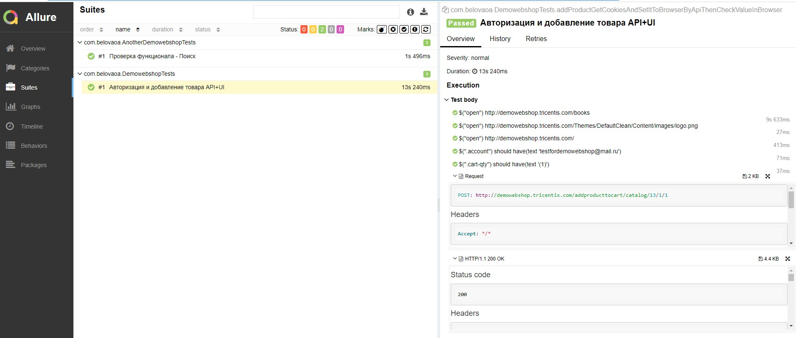
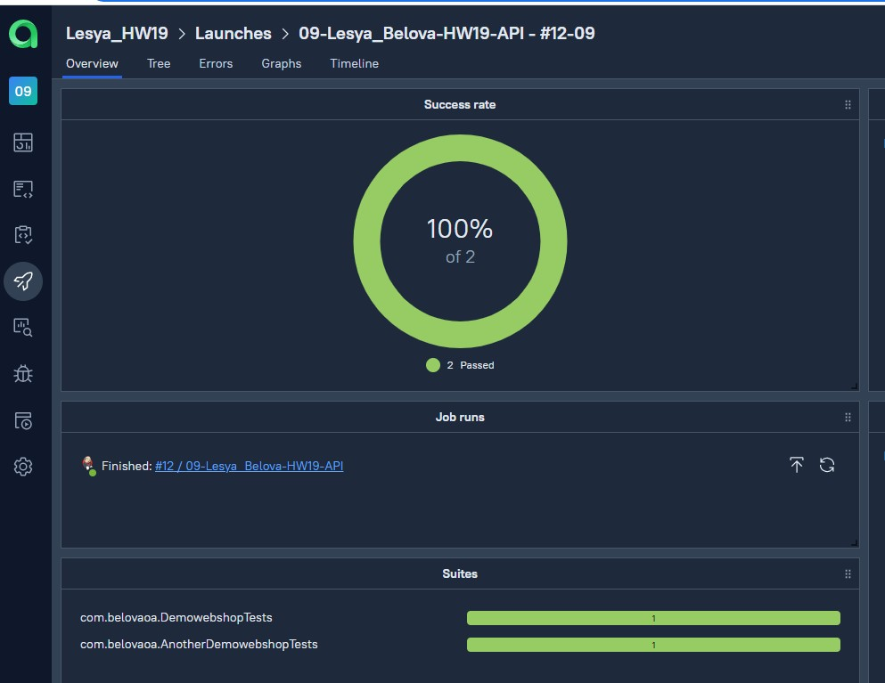
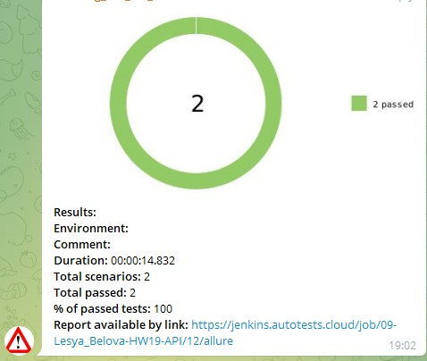

# Homework18-19_API
Сайт магазина http://demowebshop.tricentis.com/
Задача: Исследовать сайт магазина, автоматизировать проверку ui-взаимодействия по api (разработать любой автотест), сделать сборку с api-тестами в Allure Testops, 
с AllureListener & Custom templates

## :heavy_check_mark: Запуск тестов в Jenkins

:point_right: Click [here](https://jenkins.autotests.cloud/job/09-Lesya_Belova-HW19-API/) to see the job

## :heavy_check_mark: Интеграция с TMS Allure TestOps

## :heavy_check_mark: Уведомление о прохождении тестов в Telegram

